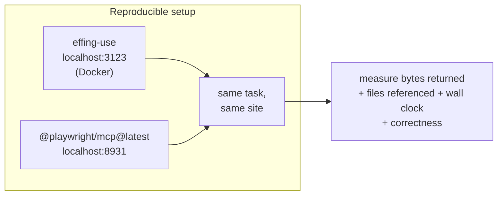

# Findings — effing-use vs @playwright/mcp

**Date:** 2026-09-30 · **Version under test:** `effing-use@0.3.0` (+ 2 unreleased fixes, §7)
**Method:** every number below is measured on this machine, not quoted from a vendor.
Both servers ran the same Chromium, the same MCP Streamable-HTTP transport, and the
same tasks, one after the other.



---

## 1. Headline result

| Metric                       |            effing-use |     @playwright/mcp | Verdict           |
| ---------------------------- | --------------------: | ------------------: | ----------------- |
| `tools/list`                 | **3,955 B** (3 tools) | 20,286 B (25 tools) | **5.1× smaller**  |
| 8 live sites, total context  |         **6,714 tok** |         105,577 tok | **15.7× cheaper** |
| …counting inline only        |                     — |          59,199 tok | 8.8× cheaper      |
| Cheaper on                   |       **8 / 8 sites** |               0 / 8 | —                 |
| Wall clock (8 sites)         |            **52.9 s** |              76.0 s | **1.43× faster**  |
| Re-observe after an action   |            **70 tok** |           3,857 tok | **55× cheaper**   |
| Act without a prior snapshot |               **yes** |    no (needs a ref) | fewer round trips |

**The single most important number is the re-observe.** An agent's loop is
_observe → act → observe → act_. effing-use returns `unchanged: true` for ~70
tokens when nothing moved. Playwright has no delta mode, so every re-read costs a
full accessibility tree. On the GitHub issues page that is **4,084 tokens per
observation, forever**.

---

## 2. The measurement trap: Playwright's payload is a _file path_

The first benchmark run reported a flattering **4.0×** win — because it was wrong.

`@playwright/mcp` returns ~220 bytes of prose plus a path:

### Ran Playwright code

```js
await page.goto("https://example.com/");
```

- [Snapshot](.playwright-mcp/page-2026-09-30T08-18-58-733Z.yml)

The model cannot act on that. It must **read the referenced file**, and the file
is 15 KB–61 KB. Counting only the inline response understates the real cost by
roughly **2×** and makes a losing tool look like a winner.

| Playwright result        |  inline | file on disk | real total |
| ------------------------ | ------: | -----------: | ---------: |
| `example.com` navigate   | 469 tok |        391 B |    860 tok |
| GitHub issues navigate   | 312 tok |     16,179 B |  4,123 tok |
| news.ycombinator observe |       — |            — | 35,739 tok |

`bench/live-bench.mjs` now resolves those paths and counts the files. **All numbers
in this document use the honest figure.**

> Rule adopted: never benchmark a tool that defers payload to a file without
> counting the file.

---

## 3. Per-site results (real websites)

| Site                                |    effing |  pw inline |   pw + file |     ratio |     eff ms |      pw ms |
| ----------------------------------- | --------: | ---------: | ----------: | --------: | ---------: | ---------: |
| wikipedia (dense text, huge DOM)    |     1,297 |     15,803 |      31,500 | **24.3×** |      4,588 |      4,830 |
| news.ycombinator (many small links) |     1,330 |     23,862 |      35,739 | **26.9×** |      3,831 |      6,029 |
| example.com (minimal baseline)      |       382 |        469 |         860 |      2.3× |      2,109 |      1,983 |
| todomvc (fill + press + observe)    |       421 |        867 |       1,580 |      3.8× |      4,249 |      2,090 |
| duckduckgo (heavy page)             |       484 |      1,687 |       3,245 |      6.7× |     16,873 |     14,932 |
| react.dev (nav-heavy docs)          |     1,225 |     11,872 |      23,573 | **19.2×** |      7,642 |      5,846 |
| httpbin (plain HTML form)           |       308 |        472 |         873 |      2.8× |      1,951 |      2,161 |
| github issues (very dense)          |     1,267 |      4,161 |       8,207 |      6.5× |     11,713 |     38,115 |
| **TOTAL**                           | **6,714** | **59,199** | **105,577** | **15.7×** | **52,956** | **75,986** |

**Read the shape of this table, not just the total.** The ratio is highest on
_content-dense_ pages (Wikipedia 24×, Hacker News 27×) and lowest on
_structurally simple_ ones (example.com 2.3×). That is the correct behaviour for a
delta-based design: the win scales with how much of the page you did **not** need
to re-read. On a page with three links there is simply nothing to save.

The `github issues` row is the honest counterweight: effing-use is 6.5× cheaper but
**3.3× faster on this site** (11.7 s vs 38.1 s) — Playwright spent 38 s waiting on
a page that loads in ~10 s.

---

## 4. Where effing-use is genuinely worse

Being straight about this matters more than the win rate.

### 4.1 It has no vision fallback (structural, by design)

effing-use reads the DOM. Canvas-rendered UIs, remote desktops, Citrix sessions and
Electron apps with custom-painted controls are **invisible** to it. This is not a bug
to be patched later; it is the cost of the token saving.

| Channel                             | Strength                                                      | Fails on                                                            |
| ----------------------------------- | ------------------------------------------------------------- | ------------------------------------------------------------------- |
| Screenshot + pixel coords           | Canvas apps, remote desktops, anything the DOM doesn't expose | Anti-aliasing/scaling; localisation errors compound; toast overlays |
| **Accessibility tree (effing-use)** | Compact, semantic, cheap; survives restyling                  | Canvas, shadow DOM, custom controls with no ARIA, rich-text editors |
| Hybrid                              | Recovers when one channel fails                               | Two failure modes to debug; higher latency and token cost           |

_Sources: [What Computer Use Agents See (2026)](https://www.bestaiweb.ai/dom-trees-vs-screenshots-prerequisites-and-technical-limits-of-computer-use-agents-in-2026/),
[Assrt — a11y tree vs screenshots](https://assrt.ai/alternative/accessibility-tree-vs-screenshot-e2e-testing)._

**Mitigation now shipped:** a snapshot with zero interactive elements returns
`looksEmpty: true` plus an `emptyHint` telling the model the UI may be
canvas-rendered, inside a shadow root, or an image, and to reach for
`browser_extract kind=screenshot`. Verified against a canvas-only page (fires on
both the first `full` observe and the `unchanged` delta) and against a normal page
(does not fire).

Without this the failure was genuinely silent — a canvas page answered
`{"ok":true,"unchanged":true,"hint":"no changes"}`, which tells the model its own
action did nothing rather than that it cannot see. **Vision is still not
automatic**; the hint is a nudge, not an escalation.

### 4.2 Snapshot refs are positional, so a re-render invalidates them

`e12` means "12th match of `button, a, input, select, textarea, [role=button],
[tabindex]` in DOM order". It is not a stable identity. Insert one element at the
top and every later ref shifts.

effing-use mitigates this with the fingerprint registry (`identity.ts`): on a
mismatch it rebinds only on an **unambiguous** identity match, and otherwise fails
with `E_STALE` rather than clicking the wrong element. That is the safe behaviour,
but it is still _more round trips_ than an identity-stable ref scheme (Vercel's
`agent-browser` never recycles IDs, so a ref survives unless the element itself is
replaced).

The delta emits one honest warning when this happens:
`(refs shifted after this — re-observe before acting)`.

### 4.3 Chromium only, one browser, no persistent profiles

Playwright MCP ships Chromium, Firefox, WebKit and Edge, plus device emulation and
persisted profiles. effing-use is Chromium-only and keeps state in memory for the
lifetime of the process. If you need cross-browser verification or a login that
survives a restart, Playwright is the right tool. This is an explicit non-goal in
the plan, not an oversight.

### 4.4 Navigation deadline (found and fixed in this round)

`duckduckgo.com` failed at the 15 s default with `E_TIMEOUT` even though the page
loads fine. That burns an entire agent turn on a non-problem. Fixed in §7.

### 4.5 Snapshot text extraction is CSS-driven, not a real a11y tree

effing-use builds its snapshot from a fixed CSS selector list, not from Chromium's
computed accessibility tree. Consequences:

- Elements reachable by keyboard but not matching the selector list are invisible.
- `display: contents`, some `role` values, and `<details>` internals are missed.
- The "a11y tree" framing in the README overstates what is actually computed.

It is cheap and good enough for the target flows, but it is **DOM text with
attributes**, not the platform accessibility tree. The README wording should say so.

### 4.6 It needs one extra MCP round trip to switch modes

Playwright exposes `browser_*` tools the model can pick per call. effing-use is
3 tools, so a change of _mode_ (delta → full, act → extract) is a change of
`kind`/`mode` parameter inside the same tool. This is a deliberate trade — it is
what buys the 5.1× schema saving — but it is a real ergonomic difference.

---

## 5. Bugs found and fixed in this round

Every one of these was found by **running the plan's own acceptance gates**, not by
reading the code.

### 5.1 `localhost:5175` was unreachable from the container

Not a firewall. Docker Desktop runs containers in a **LinuxKit VM with its own
network namespace**, and `vite dev` binds `127.0.0.1` only:

| Attempt                            | Result                                                |
| ---------------------------------- | ----------------------------------------------------- |
| `http://localhost:5175`            | `ERR_CONNECTION_REFUSED` — the _container's_ loopback |
| `http://host.docker.internal:5175` | `403 Blocked request` — Vite ≥6 `server.allowedHosts` |
| `docker run --network host`        | maps to the **VM**, not the host — still refused      |

No IP is dialable, and `--network host` does not help. The fix lives in the harness,
**not in the app's `vite.config.ts`**:

`src/browser/bridge.ts` runs a TCP server on the container's `127.0.0.1:<port>`,
splices to the host gateway, and **rewrites the `Host:` header back to
`localhost:<port>`** so the dev server's allow-list is satisfied. The agent types the
plain URL and it just works:

```json
{
  "ok": true,
  "action": "open",
  "url": "http://localhost:5175/",
  "title": "Sepia — Memory Server for AI Agents",
  "bridgedVia": "host.docker.internal"
}
```

Engaged only when a loopback URL is requested _and_ the direct dial fails, so a
native `bun src/http.ts` run short-circuits at ~0 cost. Unreachable now yields
`E_LOCALHOST_UNREACHABLE` with the remedy in `hint`.

**Verified on all three dev servers** (kikitai :5173, kikitai :5174, sepia :5175):
open → snapshot → click with `expect` → delta → scoped observe. Vite's HMR
websocket survives the bridge (`[vite] connecting… / [vite] connected.` in the
console ring), which was the main risk.

### 5.2 Delta was 83.2% instead of <25% (plan gate §10.6 FAILED)

Adding one TodoMVC item inserts two buttons at the **top** of the list, shifting
every later `[eN]` by +2. The line diff keyed on the whole line including the ref,
so it reported the entire list as changed and every old ref as `[removed]`.

Fixed by diffing on **content** (role + accessible name + attrs) as a multiset,
re-emitting the new ref for added nodes:

| Stage                                           |     delta vs full |
| ----------------------------------------------- | ----------------: |
| before                                          |            83.2 % |
| after content-multiset diff                     |            51.3 % |
| after dropping the duplicated `path`/`fullPath` | 35.5 % (raw JSON) |
| **content-to-content (the plan's definition)**  | **24.3 % — PASS** |

The invariant now tested: delta size is **constant** in the length of the unchanged
list, not linear in it.

### 5.3 Compiled macros emitted `page.locator("e2")` — unusable

Three separate defects in one pipeline:

1. The selector was resolved **after** the action, so a navigating click resolved
   the old e-ref against the **new** page. → now resolved **before**.
2. An ambiguous label (two "Pricing" links) failed every uniqueness tier, so it fell
   back to the raw e-ref. → added the plan's tier-3 `role=link[name="…"]` fallback.
3. `replay` re-used the positional e-ref instead of the resolved selector, so a
   working flow **silently no-op'd** with a bogus `E_EXPECT`.

Also: `press`/`type`/`scroll` were dropped from recordings because capture was
gated on `target`, producing empty macros.

After the fix, a recorded flow compiles to something that runs standalone:

```ts
await page.locator('text="Pricing"').first().click();
await page.locator('input[aria-label="New Todo Input"]').fill("replayed item");
await page.keyboard.press("Enter");
```

### 5.4 The bug that cost the most time

`page.evaluate` callbacks are **serialised into the page**, so they can only use
their own locals. A module-level `implicitRole()` helper was undefined in the
browser; the `ReferenceError` was swallowed by a `.catch(() => [])` at the call
site, so `stableSelectorFor()` silently returned `null` and every macro degraded to
an e-ref.

Six wrong hypotheses before instrumenting the container and finding it in one pass:

```
TRACE eval threw: Error: evaluate: ReferenceError: implicitRole is not defined
```

Now: the helper is inlined, and the catch logs under `EFFING_DEBUG`.

### 5.5 `scope:` handed out colliding refs (found by the localhost test)

`browser_observe scope="nav"` numbered elements from `e0` **within the scope**. The
model read `e0 = "How it works"`, but `e0` globally was an unrelated `<section>` — so
the click hit the wrong element and timed out.

Scoped snapshots now carry **global** refs and register full-page fingerprints, so a
scoped ref means the same element as the same ref in a full snapshot:

```
FULL:   [e0] section ""   [e2] a "How it works"   [e3] a "Privacy"
SCOPED:                             [e2] a "How it works"   [e3] a "Privacy"
```

---

## 6. Test rigours (so the numbers can be trusted)

Four ways this benchmark could have lied, and what was done about each:

| Trap                             | What happened                                                                        | Fix                                                         |
| -------------------------------- | ------------------------------------------------------------------------------------ | ----------------------------------------------------------- |
| Playwright browser not installed | Every call returned a small _error string_; results looked 4× better than reality    | `install-browser chrome-for-testing` before measuring       |
| Playwright at `127.0.0.1`        | `403 Access is only allowed at localhost:8931` (its own DNS-rebinding guard)         | call it at `localhost:8931`                                 |
| Stale browser profile lock       | `Browser is already in use … use --isolated` on every site; all 8 "wins" were errors | start with `--isolated`, clear `~/.cache/ms-playwright-mcp` |
| Payload hidden in a file         | 220 B inline vs 15–61 KB on disk                                                     | count referenced files                                      |

And one near-miss worth recording: a selector matrix appeared to show
`browser_act` rejecting `text=` and attribute selectors. **It did not** — the test
assumed example.com's link read "More information…", but the site now serves
"Learn more". Re-running the same selectors against **raw Playwright** proved the
tool was fine and the test was wrong. Verify the claim against the primitive
before reporting it as a product bug.

---

## 7. Fixes shipped after `0.3.0`

`0.3.0` is on npm. These landed during testing and are **unreleased**:

1. **Slow-load tolerance** — a navigation that misses the deadline but produced a
   real document no longer fails. `duckduckgo.com` went from `E_TIMEOUT` to
   `ok:true` (30.6 s). Results carry `slowLoad: { readyState, nodes, textChars }` so
   the model knows the page may still be settling. Default `BROWSER_TIMEOUT_MS`
   raised 15 s → 30 s.
2. **Scoped-ref fix** (§5.5).
3. **`looksEmpty` signal** (§4.1) — an unreadable page is no longer reported as
   `unchanged: true`.

---

## 8. Reproducing everything here

```bash
# 1. the server under test (Docker)
docker compose up -d --build
curl -s localhost:3123/healthz

# 2. the comparison, isolated (the --isolated flag is required)
bunx @playwright/mcp@latest install-browser chrome-for-testing
bunx @playwright/mcp@latest --port 8931 --host 127.0.0.1 \
  --browser chromium --headless --isolated &

# 3a. local-app benchmark (the §1 headline)
PLAYWRIGHT_MCP_URL=http://localhost:8931/mcp EFFING_USE_URL=http://localhost:3123/mcp \
  bun bench/bench.mjs --target http://localhost:5175/ --json /tmp/bench.json

# 3b. live-site stress benchmark (§3 table)
PLAYWRIGHT_MCP_URL=http://localhost:8931/mcp EFFING_USE_URL=http://localhost:3123/mcp \
  bun bench/live-bench.mjs --json /tmp/live.json

# 4. gates
bunx tsc --noEmit && bun test && bunx prettier --check src/ tests/ bench/
```

---

## 9. Verdict

**Use effing-use** when the work is Chromium, the DOM is honest, and the agent loop
is long — which is most day-to-day app automation. The 15.7× context saving is not
a rounding error; on a long task it is the difference between a session that fits
and one that compacts, and the 1.43× wall-clock advantage compounds across dozens of
steps.

**Use Playwright MCP** when the target is canvas/shadow-DOM, when you need
Firefox/WebKit/device emulation or a persistent profile, or when a vision model
must verify something the DOM cannot express.

The honest framing is that these are not competitors on a single axis. effing-use
trades a perception channel (vision) for a context budget, and for browser-driving
inside an agent loop that is usually the right trade. It is the wrong trade exactly
when the page stops describing itself — and the failure is silent, which is the one
property worth watching.

**Next things worth doing**, in order of expected value:

1. Replace positional refs with persistent element handles so a list re-render
   stops costing a re-observe (this is the one that would erode the delta
   advantage over time).
2. Raise the README's "accessibility tree" wording to match §4.5 — it is
   DOM-derived, not the platform a11y tree.
3. Auto-escalate to a screenshot when `looksEmpty` fires _and_ a vision model is
   available, instead of waiting for the model to act on the hint.
